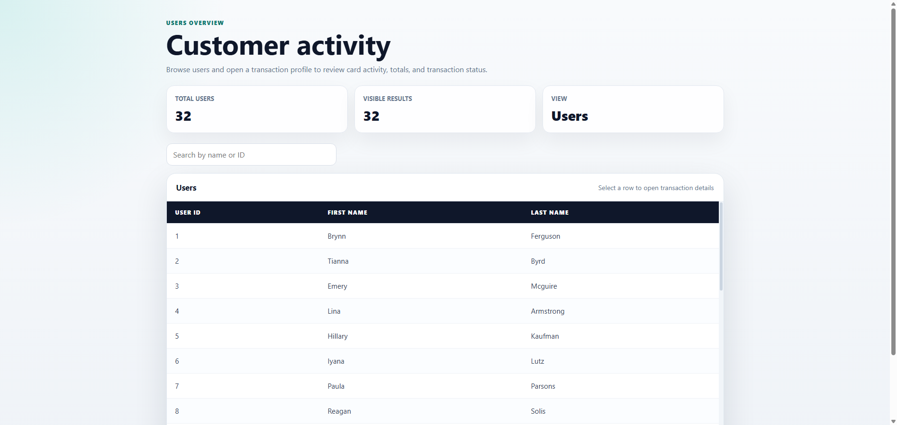
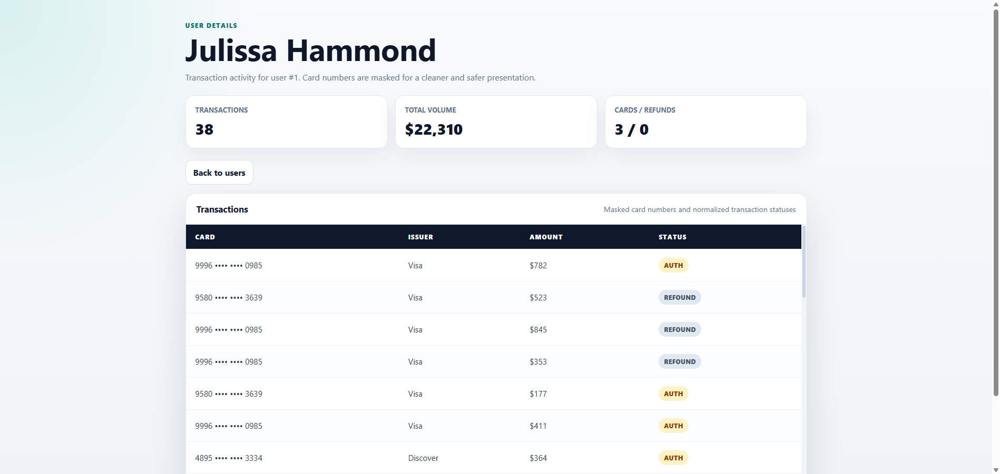

# Customer Transactions Dashboard

A full-stack dashboard for browsing customers and reviewing their transaction activity. The project includes a React/TypeScript client and a Node.js API, with Docker Compose support for running both services together.

## Screenshots

### Customer activity

The main screen shows a searchable customer table with summary cards. Selecting a customer opens the transaction profile.



### Transaction details

The details screen summarizes transaction volume, unique cards, refund counts, and a masked transaction table with status badges.



## What The Project Does

- Lists customer records in a clean dashboard table.
- Supports searching customers by name or ID.
- Opens a customer transaction profile from the table.
- Displays transaction totals, total volume, unique cards, and refund count.
- Masks card numbers for safer presentation.
- Uses status badges to make transaction types easier to scan.
- Supports direct links to transaction pages such as `/transactions/1`.
- Runs locally with Docker Compose.

## Tech Stack

| Layer | Tools |
|---|---|
| Frontend | React, TypeScript, React Router, Recoil, styled-components |
| Backend | Node.js, Express, Axios |
| Dev workflow | Docker Compose, npm |

## Run With Docker

```bash
docker compose up --build
```

Then open:

- Client: http://localhost:3000
- API: http://localhost:8000/api

## Run Without Docker

Start the server:

```bash
cd server
npm install
npm start
```

Start the client:

```bash
cd client/users-transactions
npm install
npm start
```

## Notes

This repository is presented as a standalone portfolio project. Company-specific context was intentionally removed so the project can stand on its own as a full-stack customer transactions dashboard.
